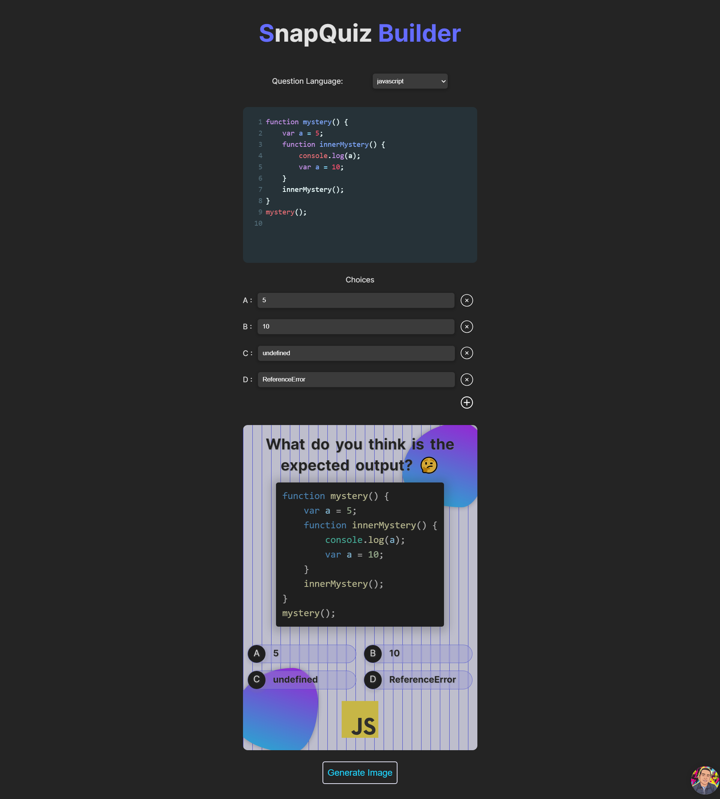

# SnapQuiz Builder

SnapQuiz Builder is a web application that allows users to generate images for code snippet questions and share them on social media. It's a fun and engaging way to challenge your friends, followers, or coding community with coding puzzles.

## Table of Contents

- [Features](#features)
- [Getting Started](#getting-started)
- [Usage](#usage)
- [Screenshots](#screenshots)
- [Technologies Used](#technologies-used)
- [Contact](#contact)

## Features

- **Code Snippet Questions:** Create and customize code snippet questions for various programming languages.
- **Image Generation:** Generate visually appealing images for your code questions with syntax highlighting.
- **Browser Theme Integration:** Automatically adapt the application theme based on the user's browser theme for a consistent and personalized experience.

## Getting Started

### Prerequisites

Make sure you have [Node.js](https://nodejs.org/) installed on your machine.

### Installation

1. Clone the repository:

   ```bash
   git clone https://github.com/your-username/snapquiz-builder.git
   ```

2. Navigate to the project directory:
   ```bash
   cd snapquiz-builder
   ```
3. Install dependencies:
   ```bash
   npm install
   ```
4. Start the development server:
   ```bash
   npm start
   ```
   The app will be accessible at http://localhost:3000 by default.
   **Don't forget to check package.json to see the other possible scripts.**

## Usage

1. Access the application in your web browser.
2. Customize your code snippet question and select the programming language.
3. Generate the image and effortlessly share it on your favorite social media platform!

## Screenshots



## Technologies Used

- HTML5
- CSS3
- JavaScript
- [React.js](https://reactjs.org/)
- [Vite](https://vitejs.dev/)
- dom-to-image - JavaScript library for converting DOM nodes to images.
- react-toastify - beautiful package for alert

## Contact

 <p align="left">

<a href="https://www.linkedin.com/in/ibrahim-ahmed-a8bba9196" target="_blank">
</a>
<a href="https://www.facebook.com/ibrahim11ahmed" target="_blank">
</a>
<a href="mailto:ibrahim11elian@gmail.com" target="_blank">
</a>
<a href="tel:+201157676284" target="_blank">
</a>
<a href="https://www.instagram.com/ibrahim11ahmed/" target="_blank">
</a>
<a href="https://twitter.com/ibrahim11elian" target="_blank">
</a>
<a href="(https://leetcode.com/ibrahim11elian/" target="_blank">
</a>

</p>

- Frontend Mentor - [@ibrahim11elian](https://www.frontendmentor.io/profile/ibrahim11elian)
